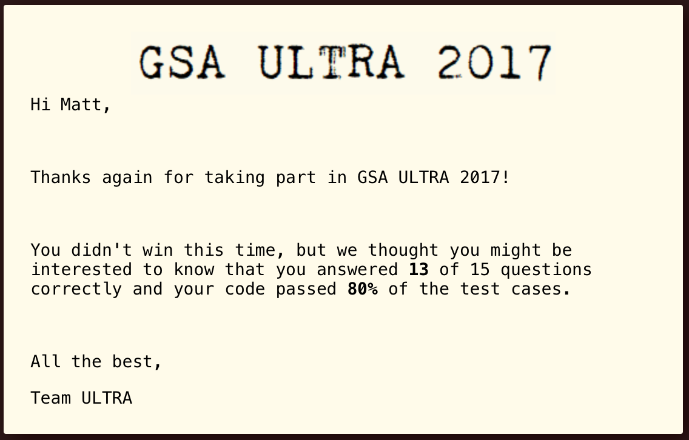

# GSA Ultra Programming Comp 2017

My solutions to a hugely enjoyable competition hosted by GSA Capital in the summer of 2017. The competition involved solving 15 self-contained problems covering a broad range of topics. 

Results after the event:  

Results released afterwards showed that I managed correct solutions to 13 of the 15 problems; 1 solution was incorrect (still haven't got around to working out which one) and the final problem is one of the [trickier problems on Project Euler](https://projecteuler.net/problem=499) which I left unanswered.
